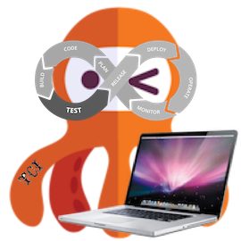

# TCI Development Environment (tci-dev-env) - Tikal Jenkins-based CI solution Development Environment

### ***TCI - Tikal Jenkins-based CI solution***

Powered by **[Tikal Knowledge](http://www.tikalk.com)** and the community.

With this repository, you can establish a TCI development environment with a Jenkins server.

### *** tci-dev-env establishment instructions***

In order to establish a  **tci-dev-env**, follow the below instructions on the server/laptop/desktop you want to host it:

1. Make sure you have the following commands installed: **git**, **docker** & **docker-compose**.
1. Make sure you have an SSH private key file on the hosting server. The default path it looks for is **~/.ssh/id_rsa**, but you can configure it to use a different file.
1. clone this repository (git@github.com:TikalCI/tci-dev-env.git) to a local folder and cd to it.
1. Run _**./tci-dev-env.sh info**_ to see that the path to the SSH private key file is correct. If it is not correct, change it in the generated **environemnts/tci-dev-env/tci.config** file.
1. Run _**./tci-dev-env.sh start**_ to load the server. 
1. The first load will take at least 10 minutes, so please wait until the prompt is back.
1. Once the load is over, browse to [http://localhost:8080](http://localhost:8080) and login with admin/admin credentials.
1. Run the **_tci-server-sanity-check_** job and see that the build passed OK (see below image).

Once the server is up, you can modify it (e.g. add LDAP configuration, add seed jobs, add credentials and much more) following the instructions as in [tci-master](https://github.com/TikalCI/tci-master).
Please notice that the environments/tci-dev-env/config.yml file is a generated file, so it is being overwriten once you release the server.

The _**./tci-dev-env.sh**_ script have the following actions: **start**, **stop**, **restart**, **info**, **reset**, **stop-reset**.
Please notice that the **reset** and **stop-reset** actions delete the Jenkins server totally, so any work done manually will be lost!

The loaded server is already configured to work with [ tci-library](https://github.com/TikalCI/tci-library) and [ tci-pipelines](https://github.com/TikalCI/tci-pipelines) from the file you specify in the **environemnts/tci-dev-env/tci.config** file.

### ***Guidelines for working on one of the TCI submodules***
In the tci-dev-env cloned working copy, there are empty submodules folder (e.g. tci, tci-library).
In order to start working on a submodule, you should initialize it by running: **./init-submodule.sh <module>** (e.g. ./init-submodule.sh tci-library).
After running the above command, you can start working on the module, while keeping the following rules:
* Always work on a feature-branch instead of the 'master' branch, and open a Pull-request once done.
* If you want the loaded Jenkins to use the branch while you work on it for the 'tci-library' and 'tci-pipelines' modules, you should also update the **environemnts/tci-server/tci.config** file accordigly and reload the server.
* Each module have a GitHub-project and GitHub-issues, so please work with it and update the issue ID (format #<number>) inside your commit messages. If the branch name contains that format, it will be done for you automatically.

